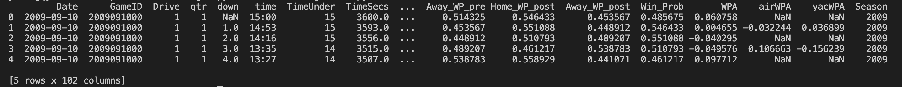
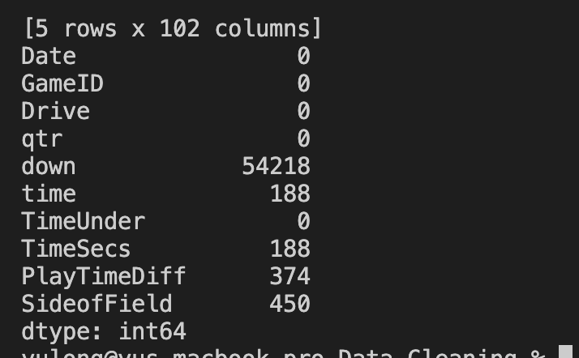
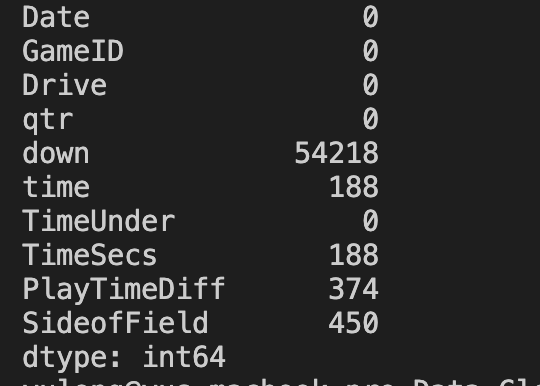
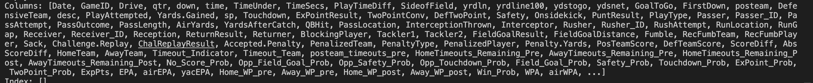
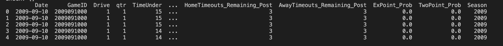
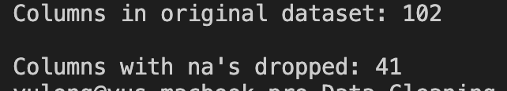
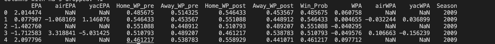
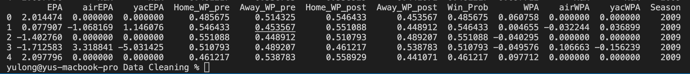
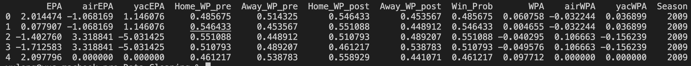

# 本篇文章以实际例子来讲解如何处理缺失值情况
## 加载数据
首先加载数据：
```
# modules we'll use
import pandas as pd
import numpy as np

# read in all our data
nfl_data = pd.read_csv("./NFL Play by Play 2009-2016 (v3).csv",low_memory=False)

# set seed for reproducibility
np.random.seed(0) 
```
加载完成之后的第一件事便是查看我们的数据结构情况，在这个案例中看到会有一些缺失值，使用NaN或者None来代替。
```
nfl_data.head()
```

## 统计缺失的数据点
```
# get the number of missing data points per column
missing_values_count = nfl_data.isnull().sum()

# look at the # of missing points in the first ten columns
miss=missing_values_count[0:10]
print(miss)
```
  
从结果中我们可以看到丢失的数据有很多，如果能统计出缺失数据所占总数据的百分比，对我们处理缺失值问题是很有帮助的。
```
# how many total missing values do we have?
total_cells = np.product(nfl_data.shape)
total_missing = missing_values_count.sum()

# percent of data that is missing
percent_missing = (total_missing/total_cells) * 100
print(percent_missing)
```
输出结果为
```
24.85847694188906
```
从结果中可以看出大概有四分之一的值丢失了，在下一步中，我们将仔细查看一些缺少值的列，并试图弄清楚它们丢失的原因是什么。

## 数据为什么丢失？
这是进入数据科学的一部分，通常称之为“数据感”，意思是“仔细看数据，并试图弄清楚为什么它是这样的，以及它将如何影响分析”。在数据科学中，这可能是一个令人沮丧的部分，特别是如果你是这个领域的新手，没有很多经验。为了处理丢失的值，可能需要使用开发者的直觉来找出为什么值丢失了。不过总的来说可以分为两点：
- 数据不存在
- 数据没被记录  
如果数据是因为不存在而丢失（像没有孩子的人的孩子身高是个不存在的数），那就没有意义去尝试和猜测它可能是什么， 这些值可能需要保留为NaN。另一方面，如果某个值因为没有记录而丢失，那么可以尝试根据该列和行中的其他值猜测它可能是什么，这个叫做imputation，下面我们就采用这种方法处理。

```
# look at the # of missing points in the first ten columns
ten10=missing_values_count[0:10]
print(ten10)
```

可以看到TimesSec这一列丢失了很多值，由于这个列代表的是游戏剩余时间，因此有可能是因为没被记录而丢失，而不是不存在。因此我们必须补充这个值。
另一方面，还有其他字段，比如“PenalizedTeam”，也有很多缺失的字段。但是，在这种情况下，场地是缺失的，因为如果没有点球，那么说哪支球队受罚是没有意义的。对于这个列，要么让它空着，要么添加第三个值，比如“neither”，并用它来替换NA，这样更有意义。（关于数据的介绍请转https://www.kaggle.com/maxhorowitz/nflplaybyplay2009to2016）
 如果你正在进行非常仔细的数据分析，这时你需要逐个查看每一列，找出填补这些缺失值的最佳策略。本文这些技术可以帮助处理丢失的值，但也可能最终删除一些有用的信息或添加一些噪声到数据中。
 ## 删除丢失值
 ```
 # remove all the rows that contain a missing value
deletedata=nfl_data.dropna()
print(deletedata)
```
 
  从图中可以看出删除了所有值，这是因为在我们的数据中的每一行都至少有一个缺失值。  
  下面是删除至少有一个缺省值的列的结果：

```
# remove all columns with at least one missing value
columns_with_na_dropped = nfl_data.dropna(axis=1)
deleteColum=columns_with_na_dropped.head()
print(deleteColum)
```
   

统计丢失的数据：
```


# just how much data did we lose?
print("Columns in original dataset: %d \n" % nfl_data.shape[1])
print("Columns with na's dropped: %d" % columns_with_na_dropped.shape[1])

```

我们已经丢失了相当多的数据，但此时我们已经成功地从数据中删除了所有NaN。

## 自动填充缺失值
另一种选择是尝试填充缺失的值。对于接下来的部分，为了更好的展示，将截取一小部分NFL数据，这样就可以很好地打印出来。
```
# get a small subset of the NFL dataset
subset_nfl_data = nfl_data.loc[:, 'EPA':'Season'].head()
subset_nfl_data
```


可以使用Panda的fillna()函数来填充数据中缺失的值。一种选择是指定我们想要用什么来替换NaN值。这里，用0替换所有NaN值。
```
# replace all NA's with 0
filldata=subset_nfl_data.fillna(0)
print(filldata)
```


还可以在同一列中，用它后面直接出现的值替换丢失的值。(这对于数据集来说很有意义，因为它们的观察具有某种逻辑顺序。)
```
# replace all NA's the value that comes directly after it in the same column, 
# then replace all the remaining na's with 0
fillComesData=subset_nfl_data.fillna(method='bfill', axis=0).fillna(0)
print(fillComesData)
```

以上就是以实际例子来讲解如何处理缺失值。
数据下载地址：
链接: https://pan.baidu.com/s/18boPYo8AP1TX3831W10qgA 提取码: ec0m 
