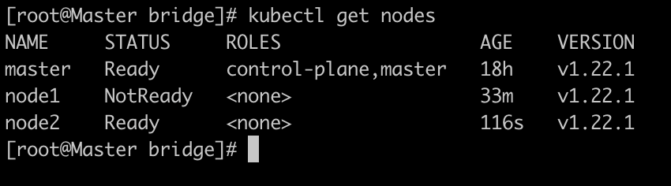

# 添加节点到集群中
## step1 准备工作
```
setenforce 0
sed -i --follow-symlinks 's/SELINUX=enforcing/SELINUX=disabled/g' /etc/sysconfig/selinux
firewall-cmd --permanent --add-port=6783/tcp
firewall-cmd --permanent --add-port=10250/tcp
firewall-cmd --permanent --add-port=10255/tcp
firewall-cmd --permanent --add-port=30000-32767/tcp
firewall-cmd --reload
```
## step2 安装Docker-CE 和 Kubernetes Repo
```
dnf config-manager --add-repo=https://download.docker.com/linux/centos/docker-ce.repo
```
```
dnf install https://download.docker.com/linux/centos/7/x86_64/stable/Packages/containerd.io-1.2.6-3.3.el7.x86_64.rpm
```
```
dnf install docker-ce
```

```
systemctl enable docker
systemctl start docker
```
```
cat <<EOF > /etc/yum.repos.d/kubernetes.repo
[kubernetes]
name=Kubernetes
baseurl=https://packages.cloud.google.com/yum/repos/kubernetes-el7-x86_64
enabled=1
gpgcheck=1
repo_gpgcheck=1
gpgkey=https://packages.cloud.google.com/yum/doc/yum-key.gpg https://packages.cloud.google.com/yum/doc/rpm-package-key.gpg
EOF
```
## Step 3: 安装 Kubeadm
```
dnf install kubeadm -y 
systemctl enable kubelet
systemctl start kubelet
```
## Step 4: kubeadm join

```
kubeadm join 9.30.215.42:6443 --token ev0gfr.gcj977p481tamyvj --discovery-token-ca-cert-hash sha256:3cfb83830bbf46b95b0a0303ddd3752301a2ec345c104b14e0abb0094627bf3d
```
```
kubectl get nodes
```


# Tip
- 若出现以下问题：
```
[root@Node2 ~]# kubectl get nodes
The connection to the server localhost:8080 was refused - did you specify the right host or port?
```
极大概率是权限问题，可以将master节点的/etc/kubernetes/admin.conf复制到当前节点相应目录，再执行命令：  
```
mkdir -p $HOME/.kube
cp -i /etc/kubernetes/admin.conf $HOME/.kube/config
chown $(id -u):$(id -g) $HOME/.kube/config
```
