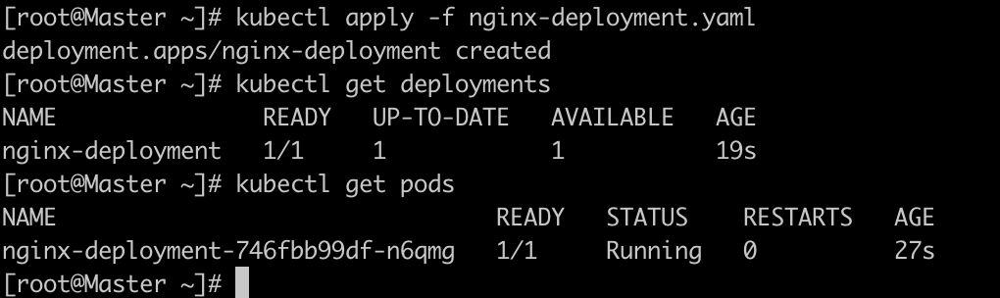
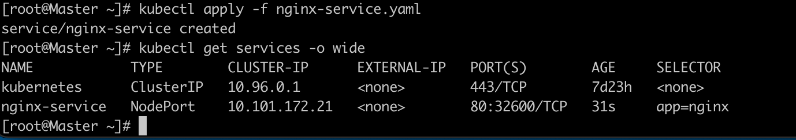
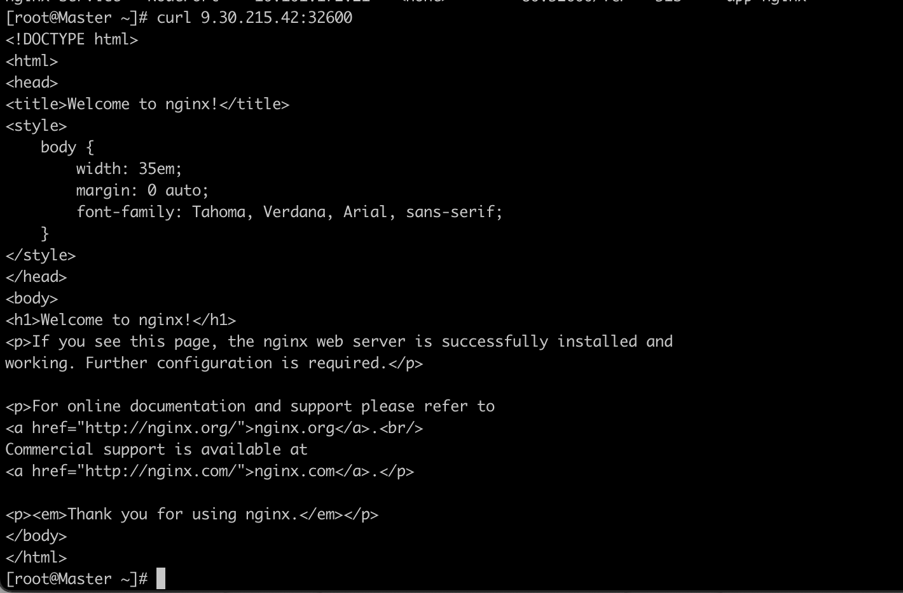
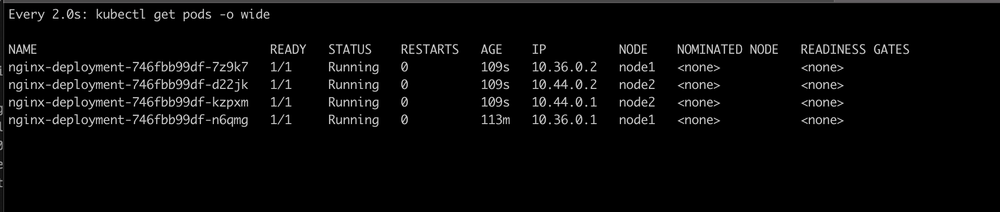

## 创建yaml文件
创建文件 nginx-deployment.yaml
```
apiVersion: apps/v1
kind: Deployment
metadata:
  name: nginx-deployment
  labels:
    app: nginx
spec:
  replicas: 1
  selector:
    matchLabels:
      app: nginx
  template:
    metadata:
      labels:
        app: nginx
    spec:
      containers:
      - name: nginx
        image: nginx:1.7.9

```
```
apiVersion: apps/v1	#与k8s集群版本有关，使用 kubectl api-versions 即可查看当前集群支持的版本
kind: Deployment	#该配置的类型，我们使用的是 Deployment
metadata:	        #译名为元数据，即 Deployment 的一些基本属性和信息
  name: nginx-deployment	#Deployment 的名称
  labels:	    #标签，可以灵活定位一个或多个资源，其中key和value均可自定义，可以定义多组，目前不需要理解
    app: nginx	#为该Deployment设置key为app，value为nginx的标签
spec:	        #这是关于该Deployment的描述，可以理解为你期待该Deployment在k8s中如何使用
  replicas: 1	#使用该Deployment创建一个应用程序实例
  selector:	    #标签选择器，与上面的标签共同作用，目前不需要理解
    matchLabels: #选择包含标签app:nginx的资源
      app: nginx
  template:	    #这是选择或创建的Pod的模板
    metadata:	#Pod的元数据
      labels:	#Pod的标签，上面的selector即选择包含标签app:nginx的Pod
        app: nginx
    spec:	    #期望Pod实现的功能（即在pod中部署）
      containers:	#生成container，与docker中的container是同一种
      - name: nginx	#container的名称
        image: nginx:1.7.9	#使用镜像nginx:1.7.9创建container，该container默认80端口可访问

```
## 部署
```
kubectl apply -f nginx-deployment.yaml
```
## 查看部署结果：
```
<!-- 查看 Deployment -->
kubectl get deployments

<!-- 查看 Pod -->
kubectl get pods
```


## 常用命令
- 获取类型为Deployment的资源列表
```
kubectl get deployments
```
- 获取类型为Pod的资源列表
```
kubectl get pods
```
- 获取类型为Node的资源列表
```
kubectl get nodes
```
在命令后增加 -A 或 --all-namespaces 可查看所有 名称空间中 的对象，使用参数 -n 可查看指定名称空间的对象，例如:  
```
# 查看所有名称空间的 Deployment
kubectl get deployments -A
kubectl get deployments --all-namespaces
# 查看 kube-system 名称空间的 Deployment
kubectl get deployments -n kube-system
```
- kubectl describe - 显示有关资源的详细信息  
格式：kubectl describe 资源类型 资源名称
```
#查看名称为nginx-XXXXXX的Pod的信息
kubectl describe pod nginx-XXXXXX	

#查看名称为nginx的Deployment的信息
kubectl describe deployment nginx
```
- kubectl logs - 查看pod中的容器的打印日志  
格式：kubectl logs Pod名称
```

#查看名称为nginx-pod-XXXXXXX的Pod内的容器打印的日志
kubectl logs -f nginx-pod-XXXXXXX
```
- kubectl exec - 在pod中的容器环境内执行命令(和命令docker exec 类似)  
格式：kubectl exec Pod名称 操作命令
```
# 在名称为nginx-pod-xxxxxx的Pod中运行bash
kubectl exec -it nginx-pod-xxxxxx /bin/bash
 
 ```
 ## 为nginx Deployment 创建service
 - 创建nginx-service.yaml文件  
 ```
apiVersion: v1
kind: Service
metadata:
  name: nginx-service
  labels:
    app: nginx
spec:
  selector:
    app: nginx
  ports:
  - name: nginx-port
    protocol: TCP
    port: 80
    nodePort: 32600
    targetPort: 80
  type: NodePort
 ```
 ```
 apiVersion: v1
kind: Service
metadata:
  name: nginx-service	#Service 的名称
  labels:     	#Service 自己的标签
    app: nginx	#为该 Service 设置 key 为 app，value 为 nginx 的标签
spec:	    #这是关于该 Service 的定义，描述了 Service 如何选择 Pod，如何被访问
  selector:	    #标签选择器
    app: nginx	#选择包含标签 app:nginx 的 Pod
  ports:
  - name: nginx-port	#端口的名字
    protocol: TCP	    #协议类型 TCP/UDP
    port: 80	        #集群内的其他容器组可通过 80 端口访问 Service
    nodePort: 32600   #通过任意节点的 32600 端口访问 Service
    targetPort: 80	#将请求转发到匹配 Pod 的 80 端口
  type: NodePort	#Serive的类型，ClusterIP/NodePort/LoaderBalancer
```
- 部署
```
kubectl apply -f nginx-service.yaml
```
- 查询部署结果
```
kubectl get services -o wide
```

- 访问服务
```
curl <任意节点的 IP>:32600
```


## 扩展
可以将ngnix的副本扩展到四个，只需将nginx-deployment.yaml配置文件中的replicas改成你需要扩展的复本数就可以了。
并执行命令：
```
kubectl apply -f nginx-deployment.yaml
watch kubectl get pods -o wide
```
