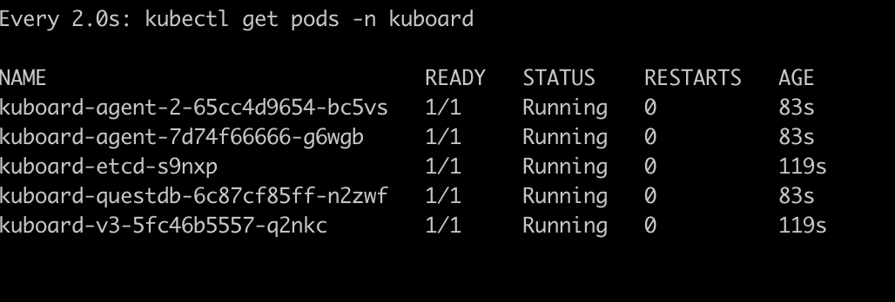

V3版本和V2版本相比，可以管理多个集群。此文档针对的是最新的V3版本

- 安装
```
kubectl apply -f https://addons.kuboard.cn/kuboard/kuboard-v3.yaml
```
- 等待就绪  

执行以下指令，等待 kuboard 名称空间中所有的 Pod 就绪，如下所示
```
watch kubectl get pods -n kuboard
```


- 登陆

登陆网址：
http://9.30.215.42:30080


输入初始用户名和密码，并登录
```
用户名： admin
密码： Kuboard123
```


- 卸载
```
kubectl delete -f https://addons.kuboard.cn/kuboard/kuboard-v3.yaml
```
- 清理遗留数据
在 master 节点以及带有 k8s.kuboard.cn/role=etcd 标签的节点上执行
```
rm -rf /usr/share/kuboard
```