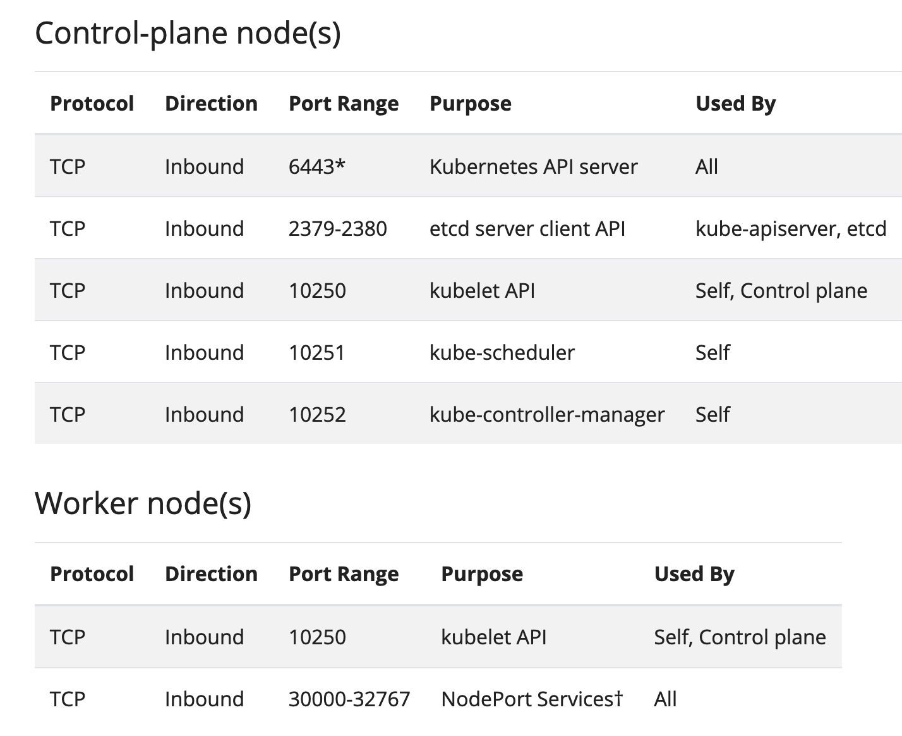
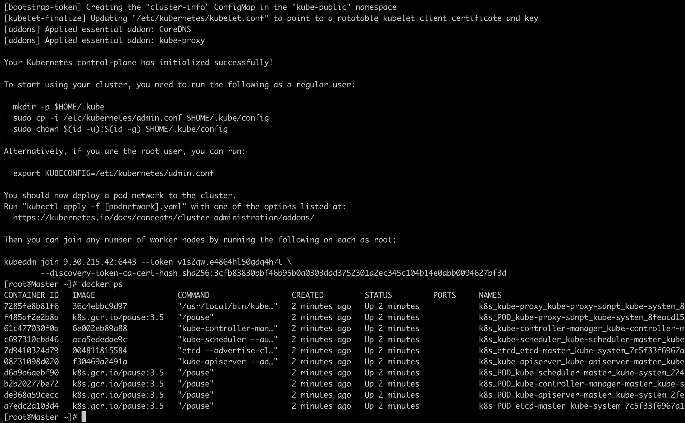
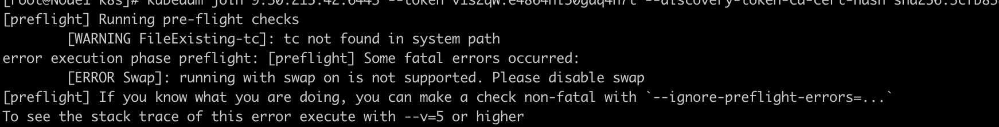

## 环境：  
Centos8.4

## step1  准备工作
每一个节点都需要有独一无二的MAC地址，有时候在特殊的情况下，虚拟机可能会有相同的MAC地址，因此需要比对下Product_UUID和MAC在所有节点中都是独一无二的。

- 检查并比对MAC地址
```
ip link
```
- 检查并比对product_uuid
```
cat /sys/class/dmi/id/product_uuid 
```

修改每个节点的hostname并配地址映射
- Master
```
[root@Master ~]# cat /etc/hostname
Master
```
- Node1
```
[root@Node1 k8s]# cat /etc/hostname
Node1
```
- Node2
```
[root@Node2 ~]# cat /etc/hostname
Node2
```
以上三个节点master Node1 Node2在目录/etc/hosts下配置地址映射：
```
10.11.115.199 Master AutoCDPMaster1
10.11.104.84 Node1 AutoCDPNode11
10.11.56.96 Node2 AutoCDPNode21
```
disable Selinux,(因为容器需要接触host文件)
```
setenforce 0
```
将setenforce设置为0将有效地将SELinux设置为permissive，有效地禁用SELinux，直到下次重新启动。要完全禁用它，可以使用下面的命令并重新启动。
```
sed -i --follow-symlinks 's/SELINUX=enforcing/SELINUX=disabled/g' /etc/sysconfig/selinux
reboot
```
Kubernetes利用各种端口进行通信和访问，这些端口需要可供Kubernetes访问。如果开启了防火墙，需要设置这些端口不受防火墙限制。  



```
firewall-cmd --permanent --add-port=6443/tcp
firewall-cmd --permanent --add-port=2379-2380/tcp
firewall-cmd --permanent --add-port=10250/tcp
firewall-cmd --permanent --add-port=10251/tcp
firewall-cmd --permanent --add-port=10252/tcp
firewall-cmd --permanent --add-port=10255/tcp
firewall-cmd --reload
modprobe br_netfilter
```
防火墙相关命令： 
查看防火墙相关状态  ： 
```
systemctl status firewalld
```
停止防火墙
```
systemctl stop firewalld
```
开启防火墙
```
systemctl start firewalld
```
关闭防火墙，重启机器后不会恢复原样
```
systemctl disable firewalld
```
开启防火墙，重启机器后不会恢复原样
```
systemctl enable firewalld
```
## step2 安装Docker-CE
如果没有安装过docker需要执行此步骤  
- 添加docker库
```
dnf config-manager --add-repo=https://download.docker.com/linux/centos/docker-ce.repo
```
- 安装containerd
```
dnf install https://download.docker.com/linux/centos/7/x86_64/stable/Packages/containerd.io-1.2.6-3.3.el7.x86_64.rpm
```
- 安装docker-ce
```
dnf install docker-ce
```
- 启动docker服务
```
systemctl enable docker
systemctl start docker
```
## step3： 安装kubeadm
- 添加Kubernetes库
```
cat <<EOF > /etc/yum.repos.d/kubernetes.repo
[kubernetes]
name=Kubernetes
baseurl=https://packages.cloud.google.com/yum/repos/kubernetes-el7-x86_64
enabled=1
gpgcheck=1
repo_gpgcheck=1
gpgkey=https://packages.cloud.google.com/yum/doc/yum-key.gpg https://packages.cloud.google.com/yum/doc/rpm-package-key.gpg
EOF
```
- 安装kubeadm
```
dnf install kubeadm -y 
```
- 启动kubeadm服务
```
systemctl enable kubelet
systemctl start kubelet
```
step3 初始化master节点
- 关掉swap
```
swapoff -a
```
- 查看/proc/sys/net/bridge/bridge-nf-call-iptables是否为1,若不为1，需要将其设置为1
```
echo '1' > /proc/sys/net/bridge/bridge-nf-call-iptables
```
- 初始化master节点
```
kubeadm init
```
成功后的界面如下：

其中命令：  
```
kubeadm join 9.30.215.42:6443 --token v1s2qw.e4864hl50gdq4h7t --discovery-token-ca-cert-hash sha256:3cfb83830bbf46b95b0a0303ddd3752301a2ec345c104b14e0abb0094627bf3d
```
需要记住，以便node节点加入时使用。一旦初始化成功，需要为用户赋予权限，以便相应用户能购使用该集群，如果使用的是root权限，执行下面命令：
```
mkdir -p $HOME/.kube
cp -i /etc/kubernetes/admin.conf $HOME/.kube/config
chown $(id -u):$(id -g) $HOME/.kube/config
```
如过是non-root用户，执行下面命令：
```
mkdir -p $HOME/.kube
sudo cp -i /etc/kubernetes/admin.conf $HOME/.kube/config
sudo chown $(id -u):$(id -g) $HOME/.kube/config
```
 - 查看节点
 ```
 kubectl get nodes
 ```
此时会看到master节点的状态为NotReady，这是因为此时还没部署 pod 网络
## step5 ：部署pod网络
这里采用Weavenet plugin 
```
export kubever=$(kubectl version | base64 | tr -d '\n')
kubectl apply -f "https://cloud.weave.works/k8s/net?k8s-version=$kubever"
```
过一些时间再次查看node状态，发现变成了Ready


# Tips

- 1，执行命令kubeadm init时可能遇到的问题
```
[kubelet-check] Initial timeout of 40s passed.
[kubelet-check] It seems like the kubelet isn't running or healthy.
[kubelet-check] The HTTP call equal to 'curl -sSL http://localhost:10248/healthz' failed with error: Get "http://localhost:10248/healthz": dial tcp 127.0.0.1:10248: connect: connection refused.
```

解决办法：  
可能1，
```
sudo swapoff -a
sudo sed -i '/ swap / s/^/#/' /etc/fstab

```
可能2:  
创建目录/etc/docker/daemon.json，并添加以下内容：
```
{
"exec-opts": ["native.cgroupdriver=systemd"]
}
```
执行命令   
```
 systemctl daemon-reload
 systemctl restart docker
 systemctl restart kubelet
```


- 2 如果出现以下问题：


则需要关掉swap

```
swapoff -a 
```

参考资料：
- https://stackoverflow.com/questions/52119985/kubeadm-init-shows-kubelet-isnt-running-or-healthy  
- https://discuss.kubernetes.io/t/the-connection-to-the-server-localhost-8080-was-refused-did-you-specify-the-right-host-or-port/1464  
- https://kubernetes.io/docs/setup/production-environment/tools/kubeadm/install-kubeadm/  
- https://k21academy.com/docker-kubernetes/the-connection-to-the-server-localhost8080-was-refused/  

