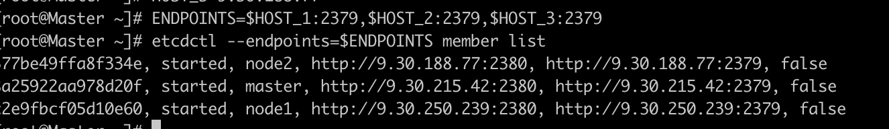
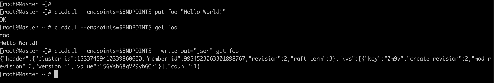
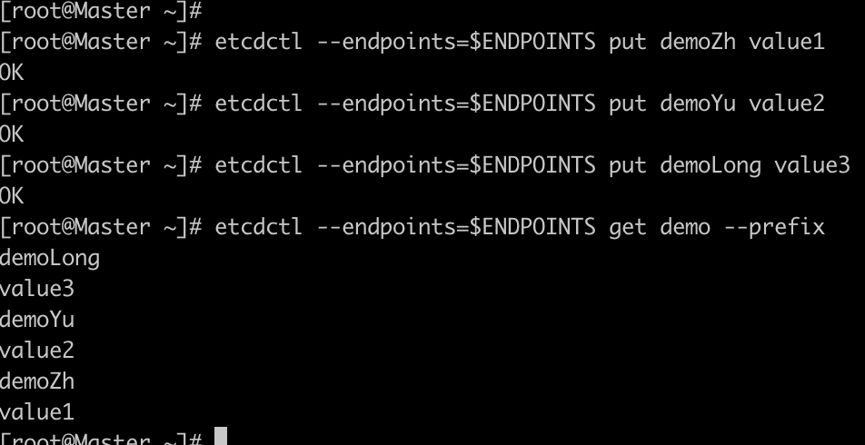
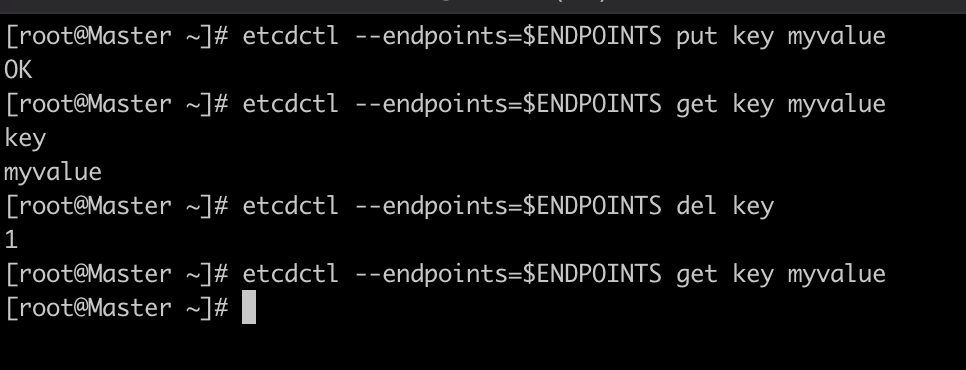
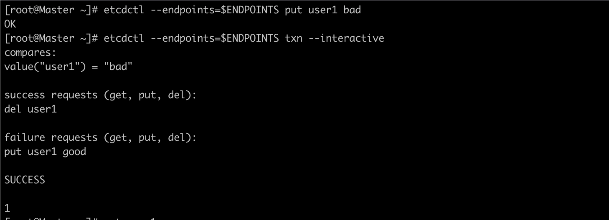
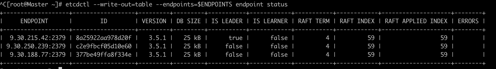
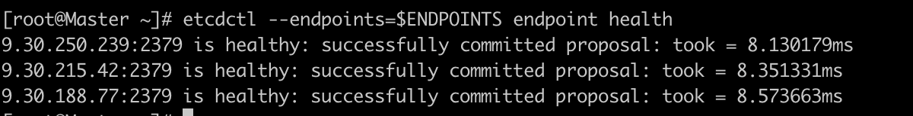
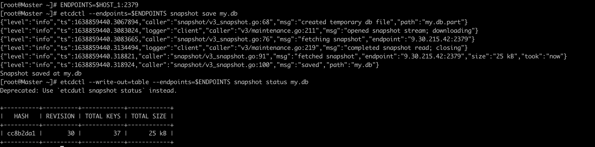

## 在每一个etcd节点指定集群成员
```
TOKEN=token-01
CLUSTER_STATE=new
NAME_1=master
NAME_2=node1
NAME_3=node2
HOST_1=9.30.215.42
HOST_2=9.30.250.239
HOST_3=9.30.188.77
CLUSTER=${NAME_1}=http://${HOST_1}:2380,${NAME_2}=http://${HOST_2}:2380,${NAME_3}=http://${HOST_3}:2380
```

## 机器1上执行

```
# For machine 1
THIS_NAME=${NAME_1}
THIS_IP=${HOST_1}
etcd --data-dir=data.etcd --name ${THIS_NAME} \
	--initial-advertise-peer-urls http://${THIS_IP}:2380 --listen-peer-urls http://${THIS_IP}:2380 \
	--advertise-client-urls http://${THIS_IP}:2379 --listen-client-urls http://${THIS_IP}:2379 \
	--initial-cluster ${CLUSTER} \
	--initial-cluster-state ${CLUSTER_STATE} --initial-cluster-token ${TOKEN}

```
## 机器2上执行：
```
# For machine 2
THIS_NAME=${NAME_2}
THIS_IP=${HOST_2}
etcd --data-dir=data.etcd --name ${THIS_NAME} \
	--initial-advertise-peer-urls http://${THIS_IP}:2380 --listen-peer-urls http://${THIS_IP}:2380 \
	--advertise-client-urls http://${THIS_IP}:2379 --listen-client-urls http://${THIS_IP}:2379 \
	--initial-cluster ${CLUSTER} \
	--initial-cluster-state ${CLUSTER_STATE} --initial-cluster-token ${TOKEN}
```
## 机器3上执行：
```
# For machine 3
THIS_NAME=${NAME_3}
THIS_IP=${HOST_3}
etcd --data-dir=data.etcd --name ${THIS_NAME} \
	--initial-advertise-peer-urls http://${THIS_IP}:2380 --listen-peer-urls http://${THIS_IP}:2380 \
	--advertise-client-urls http://${THIS_IP}:2379 --listen-client-urls http://${THIS_IP}:2379 \
	--initial-cluster ${CLUSTER} \
	--initial-cluster-state ${CLUSTER_STATE} --initial-cluster-token ${TOKEN}
```
## 使用etcdctl连接etcd
```
export ETCDCTL_API=3
HOST_1=9.30.215.42
HOST_2=9.30.250.239
HOST_3=9.30.188.77
ENDPOINTS=$HOST_1:2379,$HOST_2:2379,$HOST_3:2379

etcdctl --endpoints=$ENDPOINTS member list
```


## 从etcd集群中插入和获取值
```
etcdctl --endpoints=$ENDPOINTS put foo "Hello World!"
```


```
etcdctl --endpoints=$ENDPOINTS get foo
```

```
etcdctl --endpoints=$ENDPOINTS --write-out="json" get foo
```


## 通过前缀获取相应的Keys
```
etcdctl --endpoints=$ENDPOINTS put demoZh value1
etcdctl --endpoints=$ENDPOINTS put demoYu value2
etcdctl --endpoints=$ENDPOINTS put demoLong value3

etcdctl --endpoints=$ENDPOINTS get demo --prefix
```



## 删除key
```
etcdctl --endpoints=$ENDPOINTS put key myvalue
etcdctl --endpoints=$ENDPOINTS del key

etcdctl --endpoints=$ENDPOINTS put k1 value1
etcdctl --endpoints=$ENDPOINTS put k2 value2
etcdctl --endpoints=$ENDPOINTS del k --prefix
```


## 如何在一笔交易中进行多次写入
```
etcdctl --endpoints=$ENDPOINTS put user1 bad
etcdctl --endpoints=$ENDPOINTS txn --interactive

compares:
value("user1") = "bad"

success requests (get, put, delete):
del user1

failure requests (get, put, delete):
put user1 good
```


## 如何监视keys
一个terminal运行：
```
etcdctl --endpoints=$ENDPOINTS watch stock --prefix
```
再打开一个terminal运行：
```
etcdctl --endpoints=$ENDPOINTS put stock1 10
etcdctl --endpoints=$ENDPOINTS put stock2 20
```
如果出现以下错误：
```
Error: etcdclient: no available endpoints
```
需要在当前terminal执行：
```
export ETCDCTL_API=3
HOST_1=9.30.215.42
HOST_2=9.30.250.239
HOST_3=9.30.188.77
ENDPOINTS=$HOST_1:2379,$HOST_2:2379,$HOST_3:2379

etcdctl --endpoints=$ENDPOINTS member list
```

## 创建lease

 Lease service 提供租约的支持。Lease 是一种检测客户端存活状况的机制。群集授予具有生存时间的租约。如果 etcd 群集在给定的 TTL 时间内未收到 keepAlive，则租约到期。

为了将租约绑定到键值存储中，每个 key 最多可以附加一个租约。当租约到期或被撤销时，该租约所附的所有 key 都将被删除。每个过期的密钥都会在事件历史记录中生成一个删除事件。
```
[root@Master ~]# etcdctl --endpoints=$ENDPOINTS lease grant 300
lease 520f7d9295bac906 granted with TTL(300s)
```

```
etcdctl --endpoints=$ENDPOINTS put sample value --lease=520f7d9295bac906
```

```
 etcdctl --endpoints=$ENDPOINTS get sample
 ```

 ```
 etcdctl --endpoints=$ENDPOINTS lease keep-alive 520f7d9295bac906
 ```

```
etcdctl --endpoints=$ENDPOINTS lease revoke 520f7d9295bac906
```
## 创建分布式锁
其中一个terminal1输入：
```
etcdctl --endpoints=$ENDPOINTS lock mutex1
```

在另一个terminal2输入：
```
etcdctl --endpoints=$ENDPOINTS lock mutex1

```
此时可以看到该锁mutex1被另外一个程序占用，stop掉terminal1，则termminal2创建成功

## 如何在etcd集群中进行leader选举

```
etcdctl --endpoints=$ENDPOINTS elect one p1

# another client with the same name blocks
etcdctl --endpoints=$ENDPOINTS elect one p2
```
## 检查集群状态
```
etcdctl --write-out=table --endpoints=$ENDPOINTS endpoint status
```


```
 etcdctl --endpoints=$ENDPOINTS endpoint health
```


## 如何保存数据库
获取 etcd 数据库快照  
```snapshot``` 保存 etcd 数据库的时间点快照
快照只能从一个 etcd 节点请求，因此 --endpoints 标志应该只包含一个端点。
```
ENDPOINTS=$HOST_1:2379
etcdctl --endpoints=$ENDPOINTS snapshot save my.db
etcdctl --write-out=table --endpoints=$ENDPOINTS snapshot status my.db
```


