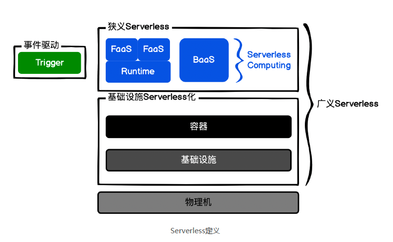

## 什么是 Serverless?
第一种：狭义 Serverless（最常见）= Serverless computing 架构 = FaaS 架构 =
Trigger（事件驱动）+ FaaS（函数即服务）+ BaaS（后端即服务，持久化或第三方服
务）= FaaS + BaaS  
第二种：广义 Serverless = 服务端免运维 = 具备 Serverless 特性的云服务  

FaaS(Function as a Service) 就是函数即服务。  
BaaS(Backend as a Service) 就是后端即服务。  
XaaS(X as a Service) 就是 X 即服务，这是云服务商喜欢使用的一种命名方式，比如我们熟悉的 SaaS、PaaS、IaaS 都是这样。  
&ensp;&ensp;&ensp;&ensp; FaaS，函数即服务，它还有个名字叫作 Serverless Computing，它可以让我们随时随地创建、使用、销毁一个函数。  

通常函数需要先从代码加载到内存，也就是实例化，然后被其它函数调用时执行。在 FaaS 中也是一样的，函数需要实例化，然后被触发器 Trigger 或者被其他的函数调用。二者最大的区别就是在 Runtime，也就是函数的上下文，函数执行时的语境。  
