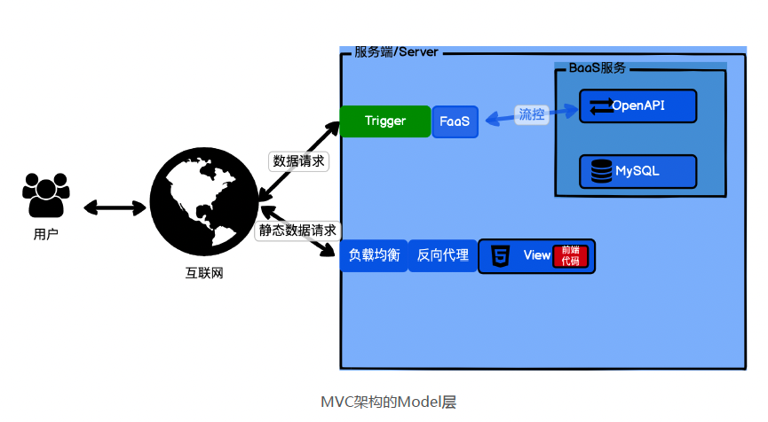

## 什么是 Serverless?
第一种：狭义 Serverless（最常见）= Serverless computing 架构 = FaaS 架构 =
Trigger（事件驱动）+ FaaS（函数即服务）+ BaaS（后端即服务，持久化或第三方服
务）= FaaS + BaaS  
第二种：广义 Serverless = 服务端免运维 = 具备 Serverless 特性的云服务    
  
&ensp;&ensp;&ensp;&ensp;FaaS(Function as a Service) 就是函数即服务。  
&ensp;&ensp;&ensp;&ensp;BaaS(Backend as a Service) 就是后端即服务。  
&ensp;&ensp;&ensp;&ensp;XaaS(X as a Service) 就是 X 即服务，这是云服务商喜欢使用的一种命名方式，比如我们熟悉的 SaaS、PaaS、IaaS 都是这样。  
&ensp;&ensp;&ensp;&ensp;FaaS，函数即服务，它还有个名字叫作 Serverless Computing，它可以让我们随时随地创建、使用、销毁一个函数。  

&ensp;&ensp;&ensp;&ensp;通常函数需要先从代码加载到内存，也就是实例化，然后被其它函数调用时执行。在 FaaS 中也是一样的，函数需要实例化，然后被触发器 Trigger 或者被其他的函数调用。二者最大的区别就是在 Runtime，也就是函数的上下文，函数执行时的语境。  

&ensp;&ensp;&ensp;&ensp;FaaS 的 Runtime 是预先设置好的，Runtime 里面加载的函数和资源都是云服务商提供的，我们可以使用却无法控制。你可以理解为 FaaS 的 Runtime 是临时的，函数调用完后，这个临时 Runtime 和函数一起销毁。  

&ensp;&ensp;&ensp;&ensp;以MVC 架构的 Web 应用举例，View 层是客户端展现的内容，通常并不需要函数算力。Control 层，就是函数的典型使用场景。MVC 架构里面，一个 HTTP 的数据请求，就会对应一个 Control 函数，我们完全可以用 FaaS 函数来代替 Control 函数。在HTTP 的数据请求量大的时候，FaaS 函数会自动扩容多实例同时运行；在 HTTP 的数据请求量小时，又会自动缩容；当没有 HTTP 数据请求时，还会缩容到 0 实例，节省开支。  
  
&ensp;&ensp;&ensp;&ensp;此刻或许你会有点疑惑，Runtime 不可控，FaaS 函数无状态，函数的实例又不停地扩容缩容，那我需要持久化存储一些数据怎么办，MVC 里面的 Model 层怎么解决？BaaS 其实是一个集合，是指具备高可用性和弹性，而且免运维的后端服务。说简单点，就是专门支撑 FaaS 的服务。FaaS 就像高铁的车头，如果我们的后端服务还是老旧的绿皮火车车厢，那肯定是要散架的。而 BaaS 就是专门为 FaaS 准备的高铁车厢。MVC 架构中的 Model 层，就需要我们用 BaaS 来解决。Model 层我们以 MySQL 为例，后端服务最好是将 FaaS 操作的数据库的命令，封装成 HTTP 的 OpenAPI，提供给 FaaS调用，自己控制这个 API 的请求频率以及限流降级。这个后端服务本身则可以通过连接池、MySQL 集群等方式去优化。各大云服务商自身也在改造自己的后端服务，BaaS 这个集合也在日渐壮大。    
   
&ensp;&ensp;&ensp;&ensp;基于 Serverless 架构，我们完全可以把传统的 MVC 架构转换为 BaaS+View+FaaS 的组合，重构或实现。这样看下来的话，狭义 Serverless 的含义也就不难理解了  ：

&ensp;&ensp;&ensp;&ensp;第一种：狭义 Serverless（最常见）= Serverless computing 架构 = FaaS 架构 =Trigger（事件驱动）+ FaaS（函数即服务）+ BaaS（后端即服务，持久化或第三方服务）= FaaS + BaaS  
&ensp;&ensp;&ensp;&ensp;Serverless 毋庸置疑正是因为 FaaS 架构才流行起来，进入大家认知的。所以我们最常见的Serverless 都是指 Serverless Computing 架构，也就是由 Trigger、FaaS 和 BaaS 架构组成的应用。这也是我给出的狭义 Serverless 的定义。  

&ensp;&ensp;&ensp;&ensp;广义 Serverless，其实就是指服务端免运维，也是未来的主要趋势。总结来说的话就是，我们日常谈 Serverless 的时候，基本都是指狭义的 Serverless，但当我们提到某个服务 Serverless 化的时候，往往都是指广义的 Serverless。