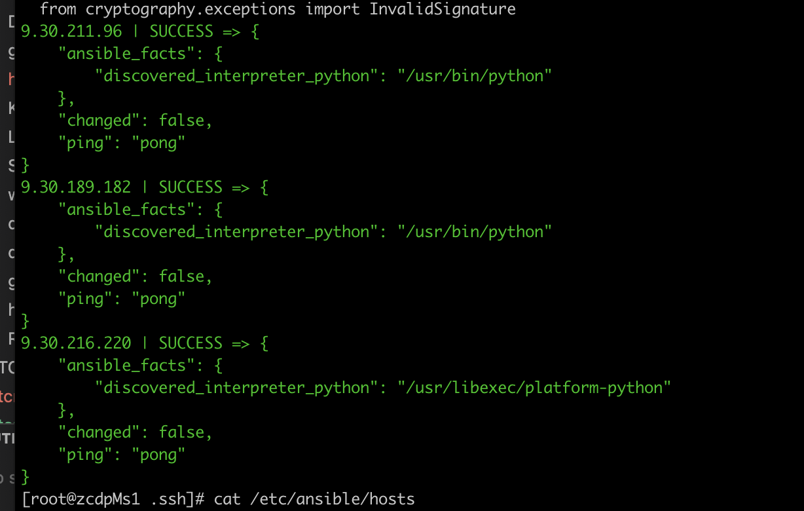
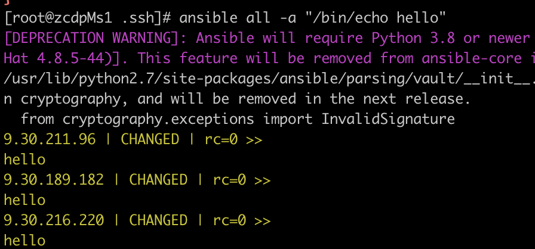
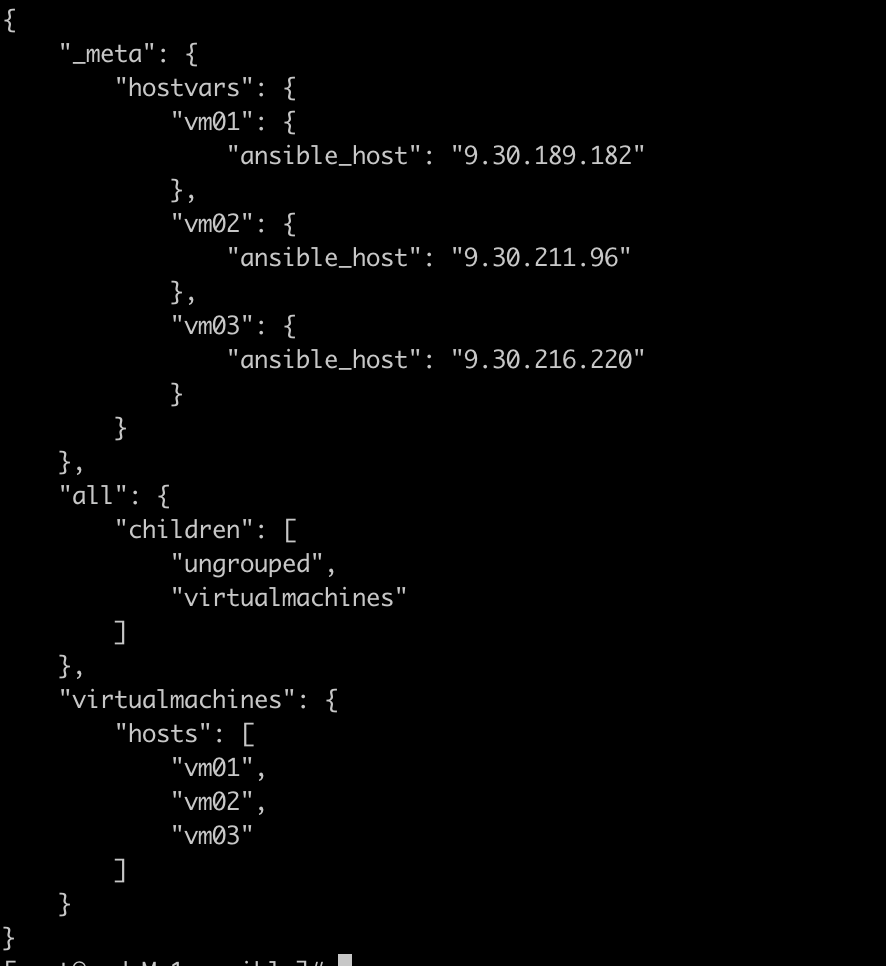
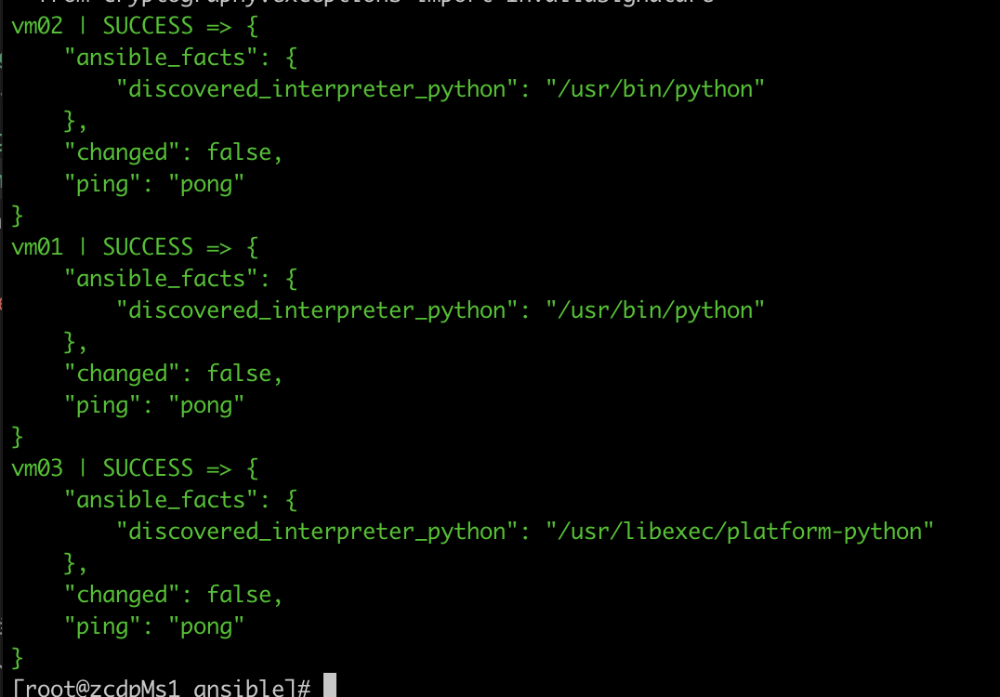
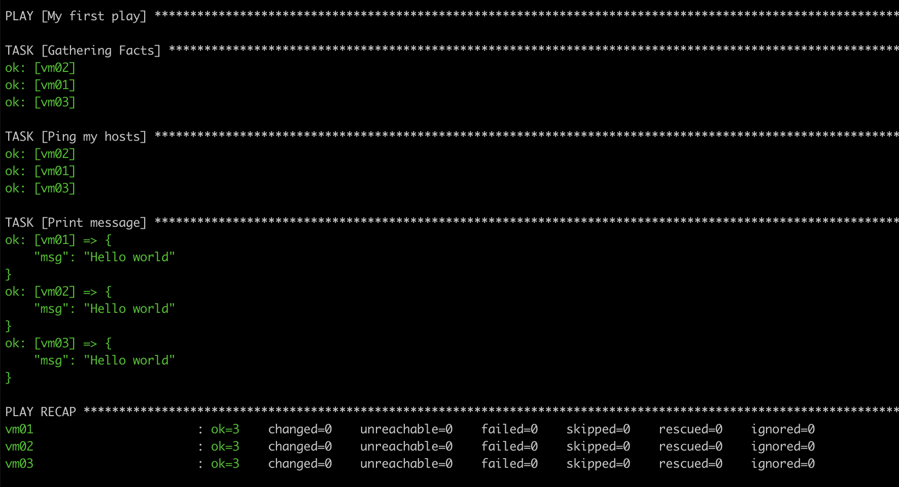
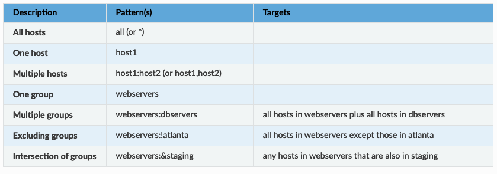

官方文档
https://docs.ansible.com/ansible/latest/getting_started/index.html

安装ansible
```
$ sudo pip install ansible
```
安装pip
```
https://www.runoob.com/w3cnote/python-pip-install-usage.html
```
编辑(或创建)/etc/ansible/hosts 并在其中加入一个或多个远程系统.你的public SSH key必须在这些系统的``authorized_keys``中:
```
9.30.189.182
9.30.211.96
9.30.216.220
```
ping 你的所有节点:
```
$ ansible all -m ping
```
  

Ansible会像SSH那样试图用你的当前用户名来连接你的远程机器.要覆写远程用户名,只需使用’-u’参数. 如果你想访问 sudo模式,这里也有标识(flags)来实现:

现在对你的所有节点运行一个命令:
```

$ ansible all -a "/bin/echo hello"

```


## Inventories  
Inventories 在为 Ansible 提供系统信息和网络位置的集中文件中组织托管节点,使用inventory文件，Ansible 可以通过单个命令管理大量主机，通过减少需要指定的命令行选项的数量，inventory还可以帮助您更有效地使用 Ansible。  
inventory文件可以是 INI 或 YAML 格式。 出于演示目的，本节仅使用 YAML 格式。
- 1,打开一个终端  
- 2,创建inventory.yaml文件  
- 3,填写host内容  
```
virtualmachines:
  hosts:
    vm01:
      ansible_host: 9.30.189.182
    vm02:
      ansible_host: 9.30.211.96
    vm03:
      ansible_host: 9.30.216.220
```
- 4， 如果您在主目录以外的目录中创建清单，请使用 -i 选项指定完整路径。
```
ansible-inventory -i inventory.yaml --list
```


- 5,ping 清单中的受管节点。 在此示例中，group名称是 virtualmachines  
```
ansible virtualmachines -m ping -i inventory.yaml
```

## playbook
Playbook 是 YAML 格式的自动化蓝图，Ansible 使用它来部署和配置托管节点。
例子：
- 1 在控制节点打开一个终端
- 2 创建playbook文件playbook.yaml
- 3 添加以下内容
```
- name: My first play
  hosts: virtualmachines
  tasks:
   - name: Ping my hosts
     ansible.builtin.ping:
   - name: Print message
     ansible.builtin.debug:
       msg: Hello world
```
- 4 运行playbook
```
ansible-playbook -i inventory.yaml playbook.yaml
```

注意：
- 起的名字应便于验证和排除故障
- Gather Facts 任务隐式运行。 默认情况下，Ansible 会收集可以在 playbook 中使用的inventory信息。
- 每个任务的状态。 每个任务都有一个 ok 状态，这意味着它运行成功。
- 在这个例子中，有 3 个任务，所以 ok=3 表示每个任务都运行成功。

## 使用metagroups
可以使用metagroups来管理多个群组，语法如下：

```
metagroupname:
  children:
```
下面是一个数据中心的例子：
```
leafs:
  hosts:
    leaf01:
      ansible_host: 192.0.2.100
    leaf02:
      ansible_host: 192.0.2.110

spines:
  hosts:
    spine01:
      ansible_host: 192.0.2.120
    spine02:
      ansible_host: 192.0.2.130

network:
  children:
    leafs:
    spines:

webservers:
  hosts:
    webserver01:
      ansible_host: 192.0.2.140
    webserver02:
      ansible_host: 192.0.2.150

datacenter:
  children:
    network:
    webservers:

```
上面的例子中：  
一个包含所有网络设备的network metagroup  
一个包含network group和所有webservers的datacenter metagroup

## 变量
变量应用于特定主机
```
webservers:
  hosts:
    webserver01:
      ansible_host: 192.0.2.140
      http_port: 80
    webserver02:
      ansible_host: 192.0.2.150
      http_port: 443
```
变量也可以应用于组中的所有主机。
```
webservers:
  hosts:
    webserver01:
      ansible_host: 192.0.2.140
      http_port: 80
    webserver02:
      ansible_host: 192.0.2.150
      http_port: 443
  vars:
    ansible_user: my_server_user
```
## Playbook的作用
- 声明配置
- 以定义的顺序在多组机器上编排任何手动设定流程的步骤
- 异步或者同步启动任务
## Playbook语法
- yaml文件格式
- Playbook由有序列表中的一个或多个“Play”组成。 每个剧本都执行剧本总体目标的一部分，运行一个或多个任务。 每个任务调用一个 Ansible 模块。
## Playbook执行
- 由上而下顺序执行
- 至少，每场比赛都定义了两件事：
    - 至少要执行一个task
    - 要定位的受管节点，使用模式
下面这个例子中，第一个play定位的是web servers，第二个paly定位的是database servers
```
---
- name: Update web servers
  hosts: webservers
  remote_user: root

  tasks:
  - name: Ensure apache is at the latest version
    ansible.builtin.yum:
      name: httpd
      state: latest
  - name: Write the apache config file
    ansible.builtin.template:
      src: /srv/httpd.j2
      dest: /etc/httpd.conf

- name: Update db servers
  hosts: databases
  remote_user: root

  tasks:
  - name: Ensure postgresql is at the latest version
    ansible.builtin.yum:
      name: postgresql
      state: latest
  - name: Ensure that postgresql is started
    ansible.builtin.service:
      name: postgresql
      state: started
```
上面这个例子中为每个play设置了remote_user，这是用于ssh的链接账户。可以通过添加Playbook Keywords影响ansible的行为。  
## Patterns: targeting hosts and groups
当通过 ad hoc 命令或运行 playbook 执行 Ansible 时，必须选择要针对哪些托管节点或组执行。Patterns让您可以针对inventory中的特定主机和/或组运行命令和剧本。 Ansible 模式可以引用单个主机、IP 地址、an inventory group, a set of groups或清单中的所有主机。 模式非常灵活——您可以排除或要求主机子集、使用通配符或正则表达式等等。 Ansible 在Patterns中包含的所有inventory hosts上执行。
#### 使用Patterns
当你执行一个ad hoc命令或者一个palybook时，肯定会用到一个pattern。  
- 1, pattern是 ad hoc 命令中唯一没有标志的元素，它通常是第二个元素：   
```
ansible <pattern> -m <module_name> -a "<module options>"
```
例如：
```
ansible webservers -m service -a "name=httpd state=restarted"
```
- 2, 在playbook中，pattern是hosts的内容
```
- name: <play_name>
  hosts: <pattern>
```
例如：
```
- name: restart webservers
  hosts: webservers
```
上面的 ad hoc 命令和 playbook 都将对 webservers 组中的所有机器执行。

#### 常见Patterns

根据以上的基本patterns，可以结合使用，比如：
```
webservers:dbservers:&staging:!phoenix
```
以组“webservers”和“dbservers”中的所有机器为目标，这些机器也在“staging”组中，但“phoenix”组中的任何机器除外。
还可以使用通配符
```
192.0.\*
\*.example.com
\*.com
```
可以同时混合通配符模式和组来使用：
```
one*.com:dbservers
```
#### Patterns的使用条件
Patterns依赖于inventory。如果一个host或者group没有在inventory列出来，那么使用pattern会出错。
如果你的pattern包含的IP地址或者hostname没有在inventory定义，会出现以下错误：
```
[WARNING]: No inventory was parsed, only implicit localhost is available
[WARNING]: Could not match supplied host pattern, ignoring: *.not_in_inventory.com
```
#### Patterns和ad-hoc命令
您可以使用命令行选项更改 ad-hoc 命令中定义的模式的行为。 您还可以使用 --limit 标志限制您在特定运行中定位的主机。
- 限制一个host
```
$ ansible -m [module] -a "[module options]" --limit "host1"
```
- 限制多个host
```
$ ansible -m [module] -a "[module options]" --limit "host1,host2"
```
- 否定限制。 请注意，必须使用单引号来防止 bash 插值。
```
$ ansible -m [module] -a "[module options]" --limit 'all:!host1'
```
- 限制host组
```
$ ansible -m [module] -a "[module options]" --limit 'group1'
```

### 从本地复制文件到远程机器
https://docs.ansible.com/ansible/latest/collections/ansible/builtin/copy_module.html
```
- name: Copy file from local to remote
  ansible.builtin.copy:
    src: /opt/software/ansible/Automation/temp/text.txt
    dest: /opt/software/demo
    owner: root
    group: root
    mode: u+rwx
```
### 从远程机器复制文件到本地
https://docs.ansible.com/ansible/latest/collections/ansible/builtin/fetch_module.html#ansible-collections-ansible-builtin-fetch-module

```
- name: Copy file from remote to local
  ansible.builtin.fetch:
    src: /opt/software/demo/text.txt
    dest: /opt/software/ansible/Automation/temp/
    flat: yes
```