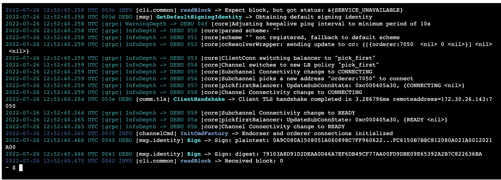
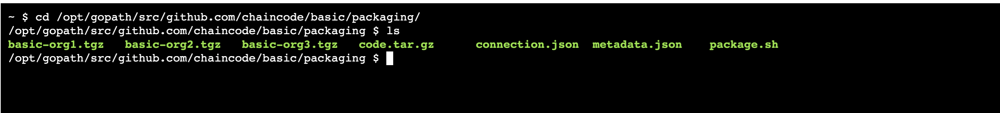

## k8s搭建hyperledger fabric
1，搭建nfs共享目录
参考笔记：  
https://github.com/yulong12/Notes/blob/main/K8s/K8s%E4%B8%ADnfs%E6%96%87%E4%BB%B6%E5%85%B1%E4%BA%AB.md

假设`/root/tensor_mnt`设置成了共享目录

2，启动ca服务器，用于生成密钥
在共享目录`/root/tensor_mnt`下创建文件夹organizations
```
mkdir organizations
```
并将prerequsite目录下的fabric-ca文件夹复制到新创建的organizations文件下
```
cp -r fabric-ca organizations/
```
启动ca服务器  
```
oc apply -f 2.ca
```
这里的oc命令和kubectl命令一样，oc是openshift的命令，注意这里启动完成后要稍等一点时间，直到相应的密钥生成后，可以查看ca容器的log日志，如果出现下面这个日志，则证明相应的密钥已经生成：
```
2022/07/27 03:34:17 [DEBUG] Generated TLS Certificate: /etc/hyperledger/fabric-ca-server/tls-cert.pem
2022/07/27 03:34:19 [DEBUG] Client authentication type requested: noclientcert
2022/07/27 03:34:19 [INFO] Listening on https://0.0.0.0:10054
```
3，生成证书
```
oc apply -f job.yaml
```
同样，要该job的证书生成后才能进行下一步  
4,创建genesis.block
```
oc apply -f job.yaml
```
5,启动orderer
```
oc apply -f 5.orderer
```
6,创建ConfigMap
```
oc apply -f builder-config.yaml
```
7,启动peers  
```
oc apply -f org1
oc apply -f org2
oc apply -f org3
```

peer节点启动成功之后，创建通道，并且使peer节点加入通道：  
1)，创建channel，cli-peer0-org1执行  
```
sh scripts/createAppChannel.sh
```


2)，其余三个peer节点分别加入channel：   
```
peer channel join -b ./channel-artifacts/mychannel.block 
```

3)，更新   
```
sh scripts/updateAnchorPeer.sh Org1MSP
```
```
sh scripts/updateAnchorPeer.sh Org2MSP
```
```
sh scripts/updateAnchorPeer.sh Org3MSP
```

8, package chaincode
参考文献：  
```
https://hyperledger-fabric.readthedocs.io/en/release-2.2/cc_service.html
```
按照如下内容修改connection.json文件  
```
{
  "address": "{{.peername}}:7052",
  "dial_timeout": "10s",
  "tls_required": false
}
```
按照如下内容修改metadata.json文件：  
```
{"path":"","type":"ccaas","label":"basic"}
```
在package目录下面执行命令：

```
tar cfz code.tar.gz connection.json
tar cfz basic-org1.tgz code.tar.gz metadata.json
tar cfz basic-org2.tgz code.tar.gz metadata.json
tar cfz basic-org3.tgz code.tar.gz metadata.json
chmod 777 -R ./*
```

9,创建chaincode镜像  

build chaincode,并且修改tag，push到ocp平台
在目录chaincode/basic下面编写Dockerfile，运行下面命令，创建chaincode镜像
```
docker build -t default-route-openshift-image-registry.apps.bj-prod-14.luban.cdl.ibm.com/demo/tcmpcc:v1.0 .

```
```
docker login -u $(oc whoami) -p $(oc whoami -t) default-route-openshift-image-registry.apps.bj-prod-14.luban.cdl.ibm.com
```
```
docker push default-route-openshift-image-registry.apps.bj-prod-14.luban.cdl.ibm.com/fabric/tcmpcc:v1.0
```

10,安装chaincode
```
cd /opt/gopath/src/github.com/chaincode/basic/packaging
ls 
peer lifecycle chaincode install basic-org1.tgz
```


记录下basic值  
```
peer0org1
basic:7df26f74ecb2f1e62c44c8358add49f982fa974fd0499358f278a0da853a2381
 peeroOrg2:
basic:82699333db3ddf87d38d46bc0f7543ac6e93aad055c298ab36a7823d94c60460
peer0Org3
basic:862d00d141cdbfff4573cef92f6c107d08c2577939f52b3d136133f5dab62db1
```

11,approve chaincode peer0-org1
```
peer lifecycle chaincode approveformyorg --channelID mychannel --name basic --version 1.0 --init-required --package-id basic:7df26f74ecb2f1e62c44c8358add49f982fa974fd0499358f278a0da853a2381 --sequence 1 -o orderer:7050 --tls --cafile $ORDERER_CA 

```
approve chaincode peer0-org2
```
peer lifecycle chaincode approveformyorg --channelID mychannel --name basic --version 1.0 --init-required --package-id basic:82699333db3ddf87d38d46bc0f7543ac6e93aad055c298ab36a7823d94c60460 --sequence 1 -o orderer:7050 --tls --cafile $ORDERER_CA 
```

approve chaincode peer0-org3
```
peer lifecycle chaincode approveformyorg --channelID mychannel --name basic --version 1.0 --init-required --package-id basic:862d00d141cdbfff4573cef92f6c107d08c2577939f52b3d136133f5dab62db1 --sequence 1 -o orderer:7050 --tls --cafile $ORDERER_CA 
```


checkcommitreadiness
```
peer lifecycle chaincode checkcommitreadiness --channelID mychannel --name basic --version 1.0 --init-required --sequence 1 -o -orderer:7050 --tls --cafile $ORDERER_CA
```


12 commit chaincode
```
peer lifecycle chaincode commit -o orderer:7050 --channelID mychannel --name basic --version 1.0 --sequence 1 --init-required --tls true --cafile $ORDERER_CA --peerAddresses peer0-org1:7051 --tlsRootCertFiles /organizations/peerOrganizations/org1.example.com/peers/peer0.org1.example.com/tls/ca.crt --peerAddresses peer0-org2:7051 --tlsRootCertFiles /organizations/peerOrganizations/org2.example.com/peers/peer0.org2.example.com/tls/ca.crt --peerAddresses peer0-org3:7051 --tlsRootCertFiles /organizations/peerOrganizations/org3.example.com/peers/peer0.org3.example.com/tls/ca.crt

```


13，invoke  
 InitLedger command
 ```
peer chaincode invoke -o orderer:7050 --isInit --tls true --cafile $ORDERER_CA -C mychannel -n basic --peerAddresses peer0-org1:7051 --tlsRootCertFiles /organizations/peerOrganizations/org1.example.com/peers/peer0.org1.example.com/tls/ca.crt --peerAddresses peer0-org2:7051 --tlsRootCertFiles /organizations/peerOrganizations/org2.example.com/peers/peer0.org2.example.com/tls/ca.crt --peerAddresses peer0-org3:7051 --tlsRootCertFiles /organizations/peerOrganizations/org3.example.com/peers/peer0.org3.example.com/tls/ca.crt -c '{"Args":["InitLedger"]}' --waitForEvent

```
invoke command
```
peer chaincode invoke -o orderer:7050 --tls true --cafile $ORDERER_CA -C mychannel -n basic --peerAddresses peer0-org1:7051 --tlsRootCertFiles /organizations/peerOrganizations/org1.example.com/peers/peer0.org1.example.com/tls/ca.crt --peerAddresses peer0-org2:7051 --tlsRootCertFiles /organizations/peerOrganizations/org2.example.com/peers/peer0.org2.example.com/tls/ca.crt --peerAddresses peer0-org3:7051 --tlsRootCertFiles /organizations/peerOrganizations/org3.example.com/peers/peer0.org3.example.com/tls/ca.crt -c '{"Args":["CreateAsset","demo4","blue","5","Tomoko","300","123","2022-3-25","2022-3-25","yulong","abe"]}' --waitForEvent

```


query command
```
peer chaincode query -C mychannel -n basic -c '{"Args":["GetAllAssets"]}'
```
```
peer chaincode query -C mychannel -n basic -c '{"Args":["ReadAsset","demo4"]}'
```
```
peer chaincode query -C mychannel -n basic -c '{"function":"ReadAsset","Args":["demo1"]}'
```

Accessing CouchDB
```
kubectl port-forward services/peer0-org1 5984:5984
```