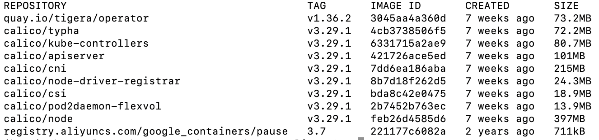

calicotar.tar包含了operator方式安装的所需镜像(amd64)：

是由以下命令打包而成：
```
docker save -o calicotar.tar quay.io/tigera/operator:v1.36.2 calico/typha:v3.29.1 calico/kube-controllers:v3.29.1 calico/apiserver:v3.29.1 calico/cni:v3.29.1 calico/node-driver-registrar:v3.29.1 calico/csi:v3.29.1 calico/pod2daemon-flexvol:v3.29.1 calico/node:v3.29.1 registry.aliyuncs.com/google_containers/pause:3.7
```

执行以下命令load：
```
docker load -i calicotar.tar

```
执行以下命令安装operator：
```
kubectl create -f tigera-operator.yaml
```
执行以下命令创建自定义资源：
```
kubectl create -f custom-resources.yaml
```