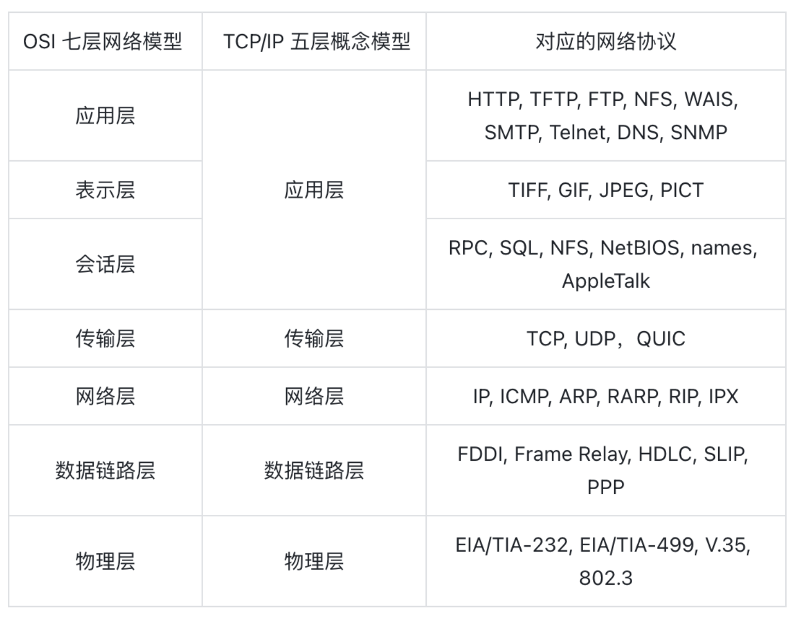
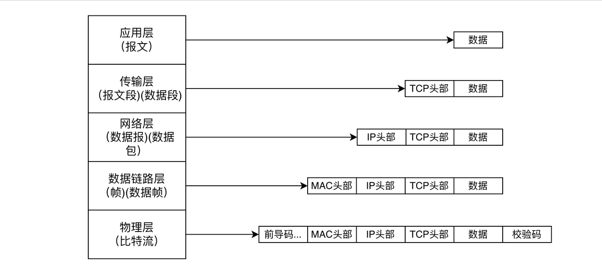
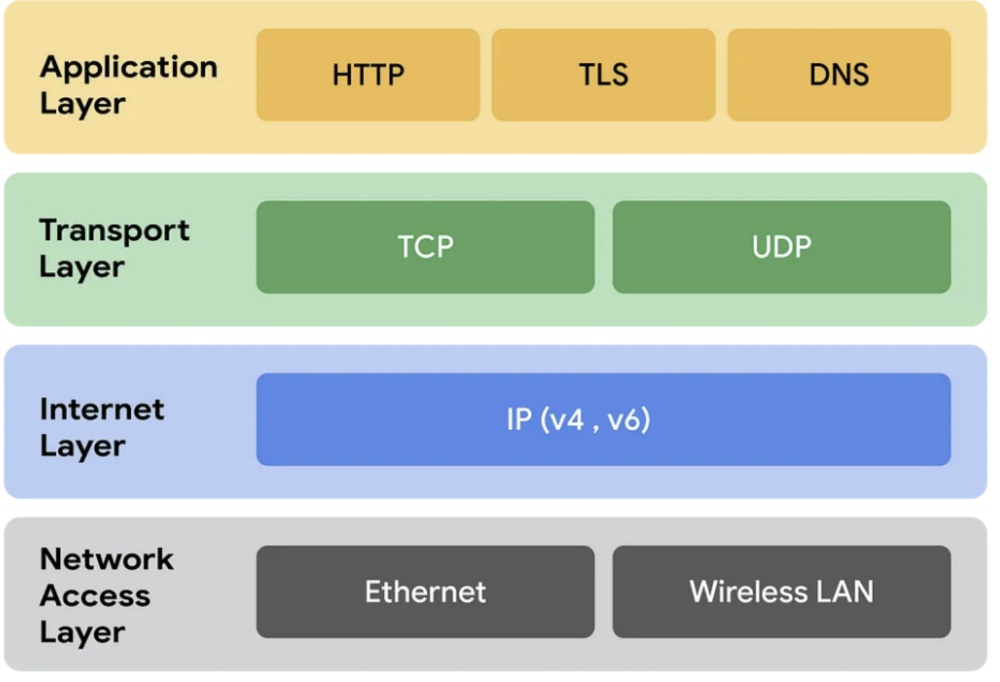

## 1. 计算机网络中两种模型对比

## 2. 数据如何在各层之间传输
假设一个主机上的一个应用向另一个主机的一个应用发送数据。

- 1. 在发送主机端，一个应用层报文被传送到传输层。在最简单的情况下，传输层收取到报文并附上附加信息，该首部将被接收端的传输层使用。
- 2. 应用层报文和传输层首部信息一道构成了传输层报文段。附加的信息可能包括：允许接收端传输层向上向适当的应用程序交付报文的信息以及差错检测位信息。该信息让接收端能够判断报文中的比特是否在途中已被改变。
- 3.  传输层则向网络层传递该报文段，网络层增加了如源和目的端系统地址等网络层首部信息，生成了网络层数据报文。
- 4. 该数据报文接下来被传递给链路层，在数据链路层数据包添加发送端 MAC 地址和接收端 MAC 地址后被封装成数据帧。
- 5. 在物理层数据帧被封装成比特流，之后通过传输介质传送到对端。而在接收主机端，整个过程正好反过来。

## 3. Ethernet, VLANs, TCP/UDP/IP, QoS, L2-L3 protocols.

## 3. TCP/IP四层模型

TCP/IP 四层模型是互联网通信的核心，定义了一系列协议和标准，确保设备间可以可靠地进行数据传输。

- 应用层（Application Layer）：直接面向用户和应用程序，提供各种网络服务。它包含了用于特定应用的协议和服务，如 HTTP（HyperText   Transfer Protocol）、FTP（File Transfer Protocol）、SMTP（Simple Mail Transfer Protocol）等。

示例：当在浏览器中输入一个 URL 并访问一个网页时，浏览器使用 HTTP 协议从 Web 服务器请求页面内容。

- 传输层（Transport Layer）：提供端到端的通信服务，确保数据可靠传输。它负责分段数据、流量控制、错误检测和纠正。常见的传输层协议有 TCP 和 UDP。

示例：当发送一封电子邮件时，TCP 协议确保邮件从你的客户端可靠地传输到邮件服务器。

- 网际层：或者叫网络层（Internet Layer），负责在不同网络之间路由数据包，提供逻辑地址（IP 地址）和网络寻址功能。用于处理数据包的分组、转发和路由选择，确保数据可以从源端传输到目标端。

常见协议：IPv4、IPv6、ICMP（Internet Control Message Protocol）。

示例：当访问一个网站时，网络层协议（如 IPv4）将你的请求从你的计算机通过多个路由器传输到目标服务器。

- 网络接口层（Network Access Layer）：或者叫链路层（Link Layer），负责将数字信号在物理通道（网线）中准确传输，定义了如何在单一网络链路上传输数据，如何处理数据帧的发送和接收，包括物理地址（MAC 地址）的解析。

常见协议：以太网（Ethernet）、Wi-Fi。

示例：在一个局域网（LAN）中，计算机通过以太网连接交换机，链路层协议负责数据帧在网络设备间的传输。
## 4. TCP
TCP

TCP（Transmission Control Protocol 传输控制协议）是一种面向连接的、可靠的、基于字节流的传输层通信协议，由 IETF 的RFC 793定义。TCP 是面向连接的、可靠的流协议。流就是指不间断的数据结构，你可以把它想象成排水管中的水流。TCP 为了保证报文传输的可靠，就给每个包一个序号，同时序号也保证了传送到接收端实体的包的按序接收。然后接收端实体对已成功收到的字节发回一个相应的确认(ACK)；如果发送端实体在合理的往返时延(RTT)内未收到确认，那么对应的数据（假设丢失了）将会被重传

## 5. UDP 

UDP 是 User Datagram Protocol 的简称， 中文名是用户数据报协议，是 OSI（Open System Interconnection，开放式系统互联） 参考模型中一种无连接的传输层协议，提供面向事务的简单不可靠信息传送服务，IETF RFC 768 是 UDP 的正式规范。UDP 在 IP 报文的协议号是17。

UDP 协议全称是用户数据报协议，在网络中它与 TCP 协议一样用于处理数据包，是一种无连接的协议。UDP 有不提供数据包分组、组装和不能对数据包进行排序的缺点，也就是说，当报文发送之后，是无法得知其是否安全完整到达的。UDP 用来支持那些需要在计算机之间传输数据的网络应用。包括网络视频会议系统在内的众多的客户/服务器模式的网络应用都需要使用 UDP 协议。

UDP 是不具有可靠性的数据报协议。细微的处理他会交给上层的应用去完成。在 UDP 的情况下，虽然可以确保发送消息的大小，确不能保证消息一定会到达。因此应用有时会根据自己的需要进行重发处理。

## 6. QoS
### QoS的定义：

- 服务质量 (QoS) 是指使用在网络上运行的机制或技术来控制流量，确保关键应用程序在有限的网络容量下的性能。它使组织能够通过优先考虑特定的高性能应用来调整其总体网络流量。

- QoS 通常适用于为资源密集型系统传输流量的网络。需要 QoS 的常见服务包括互联网协议电视 (IPTV)、在线游戏、流媒体、视频会议、视频点播 (VOD) 和 IP 语音 (VoIP)。 

- 通过使用网络 QoS，组织能够优化其网络中多个应用程序的性能，并了解其网络的比特率、延迟、抖动和数据包速率。这可确保他们能够对其网络中的流量进行工程设计，并改变数据包传送到互联网或其他网络的方式，以避免传输延迟。这还可确保组织能够实现应用程序的预期服务质量，并提供预期的用户体验。

- 根据 QoS 的含义，关键目标是使网络和组织能够优先处理流量，包括提供专用带宽、控制抖动和降低延迟。用于确保这一点的技术对于提高业务应用程序、广域网 (WAN) 和服务提供商网络的性能至关重要

### QoS 的工作原理是什么？

- QoS 网络技术通过标记数据包来识别服务类型，然后根据优先级配置路由器，为每个应用程序创建单独的虚拟队列。因此，带宽被保留用于具有优先权限的关键应用程序或网站。 

- QoS技术为网络流量中的特定流量分配容量和处理优先级。这使得网络管理员能够指定数据包的处理顺序，并为每个应用程序或流量提供适当的带宽。

### 网络流量类型
了解 QoS 网络软件的工作原理有赖于定义软件测量的各种流量类型。流量类型包括：

- 带宽：链路的速度。QoS 可以告诉路由器如何使用带宽。例如，为不同流量类型的不同队列分配一定量的带宽。
- 延迟：数据包从源头传输到最终目的地所需的时间。这通常受到排队延迟的影响；排队延迟发生在拥塞期间，数据包在队列中等待一段时间后才会被传输。QoS 使组织能够通过为某些类型的流量创建优先级队列来避免这种情况。
- 丢失：数据包丢失造成的数据丢失，通常是网络拥塞所致。QoS 使组织能够决定在这种情况下应丢弃哪些数据包。
- 抖动：网络中数据包的速度因拥塞而变得不稳定，这可能会导致数据包延迟到达和顺序不正确。这可能会导致交付的音频和视频失真或断断续续。

### QoS涉及到的技术

- 通过路由器和交换机确定延迟敏感 VoIP 流量的优先级：许多企业网络可能会变得过于拥塞，这会导致路由器和交换机丢弃传入和传出速度超出网络处理能力的数据包。因此，流媒体应用程序会受到影响。确定优先化使流量能够进行分类，并根据其类型和目的地获得不同的优先级。这在非常拥塞的情况下特别有用，因为优先级较高的数据包可以先于其他流量发送。
- 资源预留：资源预留协议 (RSVP) 是传输层协议，它会预留网络中的各种资源，且可用于为应用程序数据流提供特定水平的 QoS。资源预留使企业能够按不同的类型和来源的流量划分网络资源，设置限制，保证带宽。
- 排队：排队是指通过创建策略来使某些数据流比其他数据流得到优先处理。队列是路由器和交换机中的高性能内存缓冲区，流经队列的数据包将被保留在专用内存区域中。获得更高优先级的数据包将会转移到专用队列，该队列以更快的速度推送数据，从而降低数据包丢失的可能性。例如，企业可以分配策略，以使语音流量获得比大部分网络带宽更高的优先级。然后，路由设备或交换设备会将此流量的数据包和帧移动到队列前面，并立即传输它们。
- 流量标记：当识别出需要优先于网络中其他带宽的应用程序时，需要标记这些流量。这可以通过服务类别 (CoS) 和差分服务代码点 (DSCP) 等进程来实现——前者在第 2 层帧标头中标记数据流，后者在第 3 层数据包标头中标记数据流。
### QoS的最佳实践

- 确保源接口和安全策略的带宽上限不会设置得太低，以防止过度丢包。
- 考虑在可用队列之间分配数据包的比率，以及哪些队列用于哪些服务，因为这可能会影响延迟级别、队列分配和数据包分配。
- 只对特定服务提供带宽保证。这样可避免在高流量情况下所有流量都使用同一个队列的可能性。
- 通过基于服务的优先级或安全策略优先级（不能同时使用这两者）配置所有流量的优先级。这样可简化分析和故障排除。
- 尽量降低 QoS 配置的复杂性，以确保高性能。
- 为了获得准确的测试结果，应使用用户数据报协议 (UDP)，并且不要过度订阅带宽吞吐量。

## 7. L2-L3 protocols

- L2其实是指七层网络协议中的第二层数据链路层，它的传输是以mac地址为基础。
- L3指网络层：是以ip地址为基础。
 ## 8. WLAN
 https://cloud.tencent.com/developer/article/1412795
 