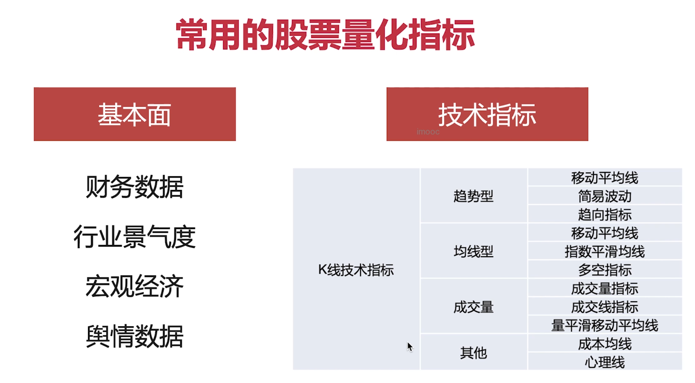
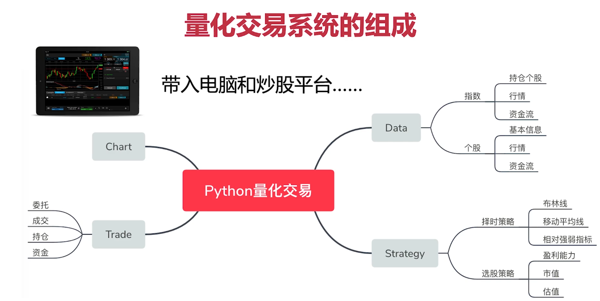
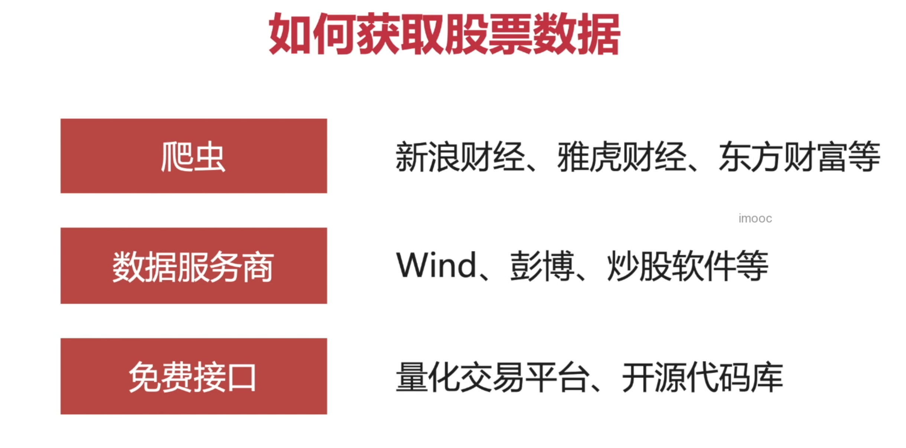
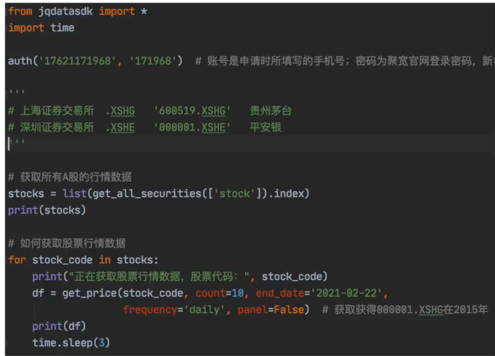
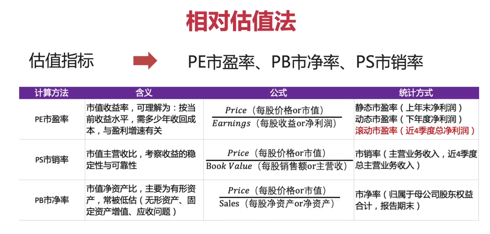
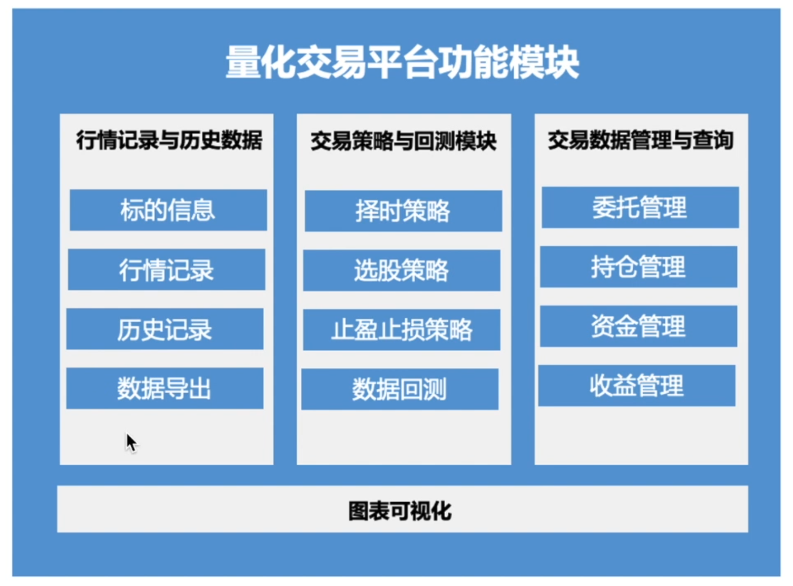

## 常用股票量化指标

## 量化交易系统的组成

## 股票的由来
股票是股份公司发行的所有权凭证，是一种投资工具、投资介质

## 股票的特性
- 股票=》股份公司的所有权凭证、盈亏自负  
- 基金=》投资组合（股票、债券、现金）  
- 债券=》还本付息的有价证券（国债、企业债、金融债券）
风险： 股票（10%）>基金（5%）>债券（1%）
收益： 股票>基金>债券

## 使用JQData获取行情数据

### 如何获取股票数据



###  使用JQData获取行情数据


### 使用resample函数转化为时间序列
```

from jqdatasdk import *
import pandas as pd
# import time
auth("18811158173","demo123Demo")

# df=get_all_securities(types=['stock'])
# print(df[:2])
# 设置行列不忽略
pd.set_option('display.max_rows',100000)
pd.set_option('display.max_columns',10)
'''resample函数的使用'''
#转换周期：日K转换为周K
df=get_price('000001.XSHG',count=20,end_date='2022-02-22',frequency='daily',panel=False)
df['weekday']=df.index.weekday

print(df)
# 获取周K（当周的）：开盘价（当周第一天）、收盘价（当周最后一天）、最高价（当周）、最低价（当周）
df_week=pd.DataFrame()
df_week['open'] =df['open'].resample('W').first()
df_week['close'] =df['close'].resample('W').last()
df_week['high'] =df['high'].resample('W').max()
df_week['low'] =df['low'].resample('W').min()

print(df_week)

#汇总统计：统计一下月成交量、成交额(Sum)
df_week['volume(sum)']=df['volume'].resample('W').sum()
df_week['money(sum)']=df['money'].resample('W').sum()

print(df_week)

```
### 财务报表
资产负债表：体现企业家底和负债情况
利润表：公司盈利能力，赚了多少、怎么赚的，隐含着对未来利润增长的预期，体现市场空间，成长能力
现金流量表： 权责发生制VS收付实现制，体现造血能力，竞争优势，议价优势

#### 利用财务报表数据选股
```
# 获取财务指标数据
df=get_fundamentals(query(indicator),statDate='2021')
# 基于盈利指标选股：eps，operating_profit,roe,inc_net_profit_year_on_year
df=df[(df['eps']>0)&(df['operating_profit']>2212173617)&(df['roe']>11)&(df['inc_net_profit_year_on_year'])>10]
print(df)
```

### 有哪些估值方法
#### 绝对估值法
定价模型：计算企业的内在价值
#### 相对估值法


## 量化交易系统


### 代码实操


